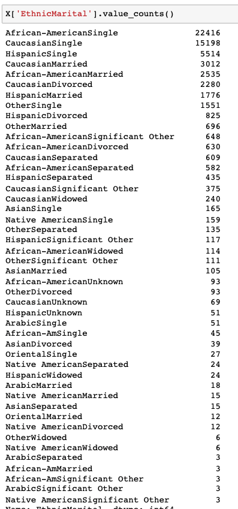

# Un/Regularization Experiment

Let me first describe the experiments:
 - Model = LogisticRegression 
 - TargetEncoderRegularizer = Guassian Noise [0,1]
 - Data = Compass with 7 caterogical features.

I have feature engieneered one feature that is highly descriptive EthnicMarital, its a concatenation of the Ethnicity and marital status. It has de following values with each frecuency.

The two selected groups for fairness are
-  GROUP1 = "African-AmericanSingle" #22416
- GROUP2 "CaucasianSeparated" #609

 

The experiment is to not regularize anything, and then regularize feature by features

## Regularizing the main feature of the model 
 
## Features where there is small to non-existent trade-off
 
## Feature where there is some trade-off.
The categorical features of this feat, have to correlate with the other one. Still the trade-off is smaller, both in accuracy and fairness.
 
