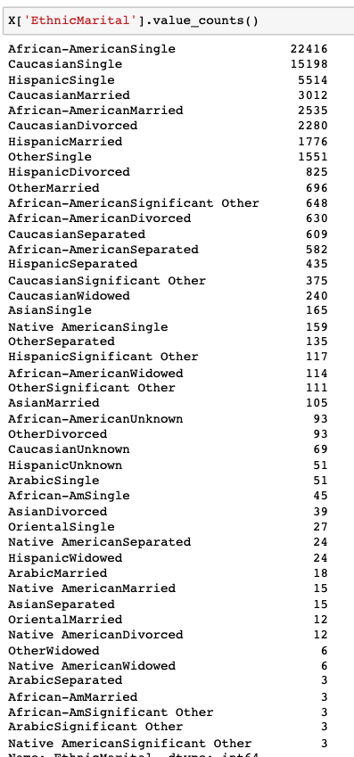
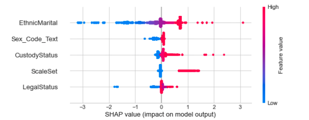
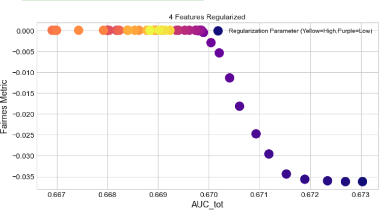
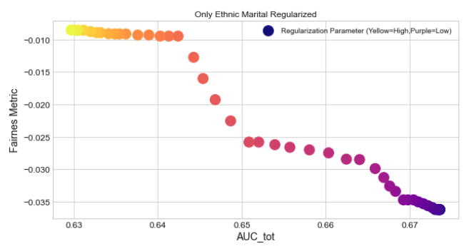
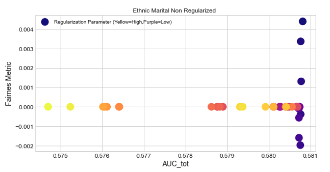

Let me first describe the experiments:
 - Model = LogisticRegression 
 - TargetEncoderRegularizer = Guassian Noise [0,1]
 - Data = Compass with 4 caterogical features.

I have feature engieneered one feature that is highly descriptive EthnicMarital, its a concatenation of the Ethnicity and marital status. It has de following values with each frecuency.

The two groups are
-  GROUP1 = "African-AmericanSingle" #22416
- GROUP2 "CaucasianSeparated" #609

 

Some SHAP xAI
 

 ## Regularizing everything
  

  ## Regularizing ONLY Ethnic Marital
  I notice 2 things
   - The range of AUC is greater 
   - The fariness metric is not 0 at any point.
   

## Regularizing ALL but EthnicMarital
 - AUC is low, and it changes little -- AUC = 0.5 is random guessing
 - Highly regularized the model is Fair. Since there is no regularization and there is high cardinality, the model is overfitting greatly. The test set is almost random. 

  

